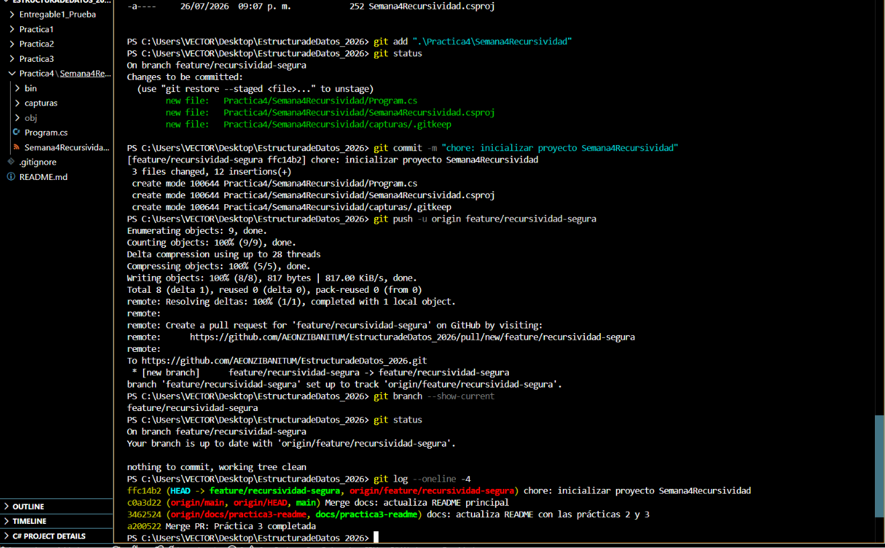
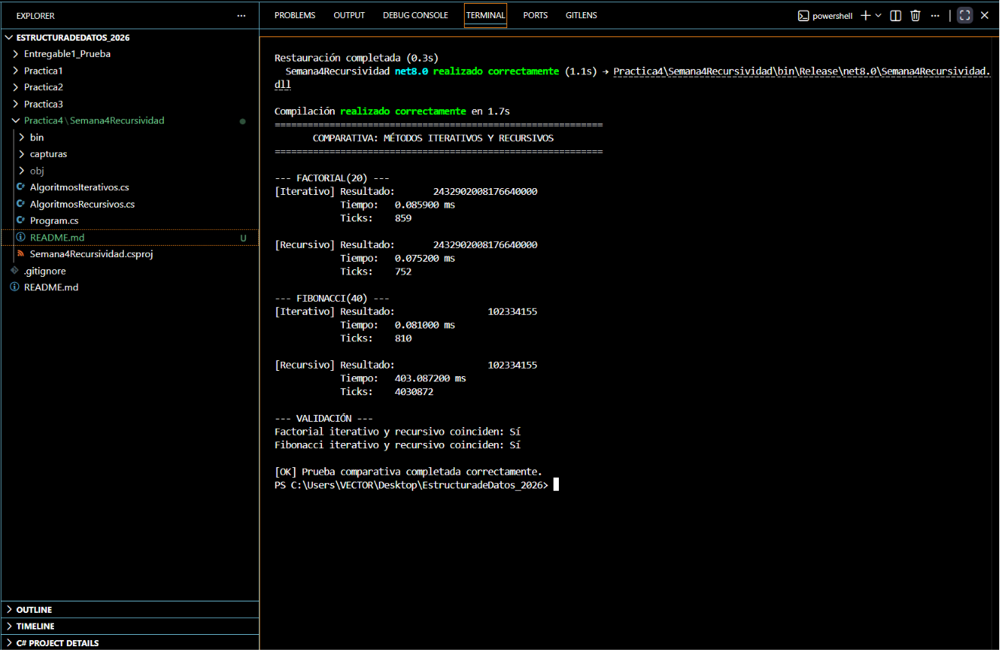
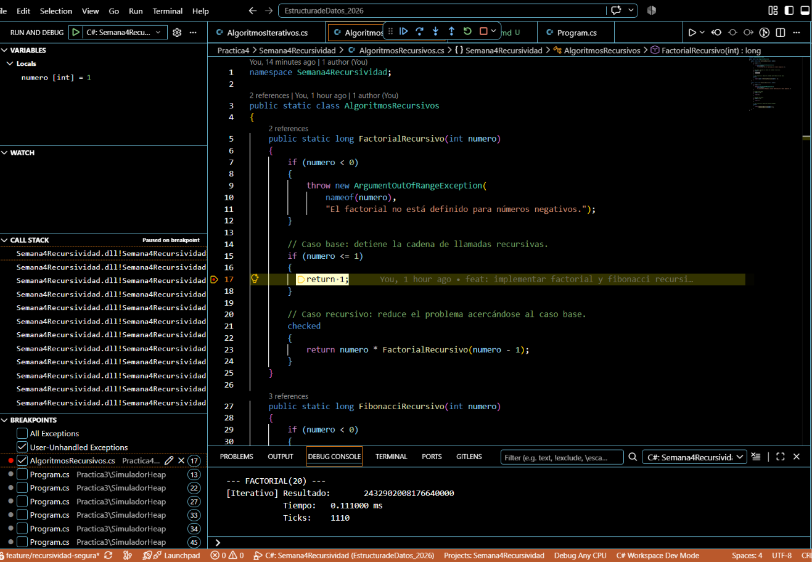
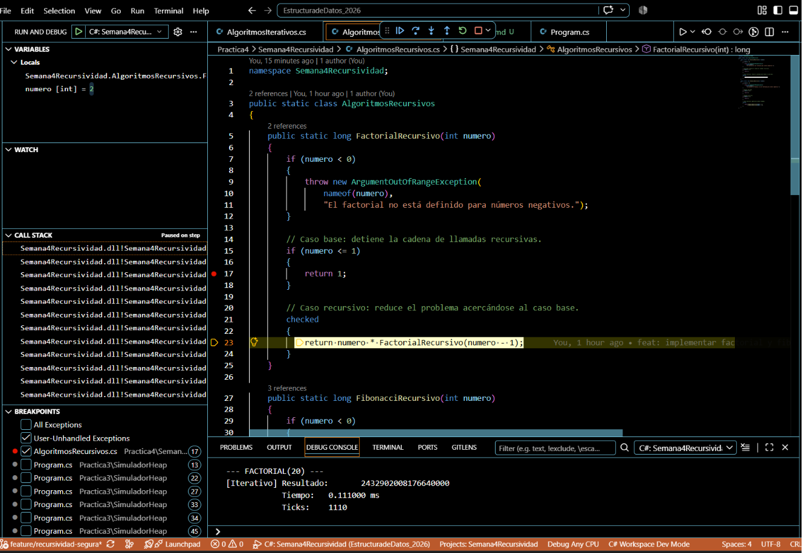

# Práctica 4 — Implementación Segura de Recursividad en C#

Implementación, validación y comparación de algoritmos iterativos y recursivos para calcular factoriales y valores de la sucesión de Fibonacci utilizando C#, .NET 8, `System.Diagnostics.Stopwatch`, depuración del Call Stack y control de versiones con Git y GitHub.

---

## Datos del estudiante

- **Nombre:** Jose Paulo Santana Ramirez
- **Matrícula:** 14868430
- **Materia:** Estructura de Datos
- **Ciclo:** 26-3
- **Tecnología:** C# con .NET 8
- **Editor:** Visual Studio Code
- **Repositorio:** `EstructuradeDatos_2026`
- **Rama de desarrollo:** `feature/recursividad-segura`

---

## Objetivo de la práctica

Comprender las diferencias funcionales, espaciales y de rendimiento entre los enfoques iterativo y recursivo mediante la implementación de:

- Factorial iterativo.
- Factorial recursivo.
- Fibonacci iterativo.
- Fibonacci recursivo.
- Medición comparativa con `Stopwatch`.
- Observación del Call Stack mediante breakpoints.
- Verificación del caso base.
- Comprobación del proceso de desapilamiento.
- Validación de entradas negativas.
- Detección de desbordamientos aritméticos.

La práctica permite identificar la importancia del caso base como condición de terminación y como mecanismo de seguridad frente a una recursión infinita o un posible `StackOverflowException`.

---

## Estructura del proyecto

```text
Semana4Recursividad/
├── capturas/
│   ├── .gitkeep
│   ├── 01_scaffold_inicial_y_rama.png
│   ├── 03_comparativa_stopwatch.png
│   ├── 04_call_stack_factorial_caso_base.png
│   └── 05_call_stack_factorial_desapilado.png
├── AlgoritmosIterativos.cs
├── AlgoritmosRecursivos.cs
├── Program.cs
├── README.md
└── Semana4Recursividad.csproj
```

---

## Preparación inicial

La práctica fue desarrollada dentro del repositorio académico existente:

```text
EstructuradeDatos_2026
```

Antes de comenzar se verificó:

- Ubicación correcta en la raíz del repositorio.
- Rama principal `main`.
- Sincronización con `origin/main`.
- Árbol de trabajo limpio.
- Disponibilidad de .NET SDK 8.
- Historial previo de las prácticas anteriores.

Se creó la rama:

```text
feature/recursividad-segura
```

Después se generó el proyecto:

```text
Practica4/Semana4Recursividad
```

dirigido explícitamente a:

```text
net8.0
```

La carpeta `capturas` se creó desde el inicio y se agregó un archivo `.gitkeep` para permitir que Git registrara la carpeta aunque inicialmente estuviera vacía.

---

## Archivos principales

### `AlgoritmosIterativos.cs`

Contiene las implementaciones:

```csharp
FactorialIterativo(int numero)
FibonacciIterativo(int numero)
```

### `AlgoritmosRecursivos.cs`

Contiene las implementaciones:

```csharp
FactorialRecursivo(int numero)
FibonacciRecursivo(int numero)
```

### `Program.cs`

Funciona como harness de prueba y realiza:

- Ejecución de los cuatro algoritmos.
- Medición de tiempos con `Stopwatch`.
- Registro de milisegundos.
- Registro de ticks.
- Comparación de resultados.
- Validación de coincidencia entre enfoques.

---

# Algoritmos implementados

## Factorial iterativo

Calcula el factorial mediante un ciclo `for`, multiplicando progresivamente los valores desde `2` hasta el número solicitado.

Definición:

```text
n! = 1 × 2 × 3 × ... × n
```

Características:

- Complejidad temporal: `O(n)`.
- Complejidad espacial: `O(1)`.
- No genera llamadas adicionales en el Call Stack.
- Conserva únicamente un acumulador y una variable de control.
- Utiliza `checked` para detectar desbordamientos.

---

## Factorial recursivo

Reduce el problema mediante llamadas sucesivas a la misma función:

```text
Factorial(n) = n × Factorial(n - 1)
```

Caso base:

```csharp
if (numero <= 1)
{
    return 1;
}
```

Caso recursivo:

```csharp
return numero * FactorialRecursivo(numero - 1);
```

Características:

- Complejidad temporal: `O(n)`.
- Complejidad espacial: `O(n)`.
- Cada llamada agrega un nuevo marco al Call Stack.
- Las llamadas permanecen pendientes hasta alcanzar el caso base.
- El argumento disminuye progresivamente hasta llegar a `1`.

---

## Fibonacci iterativo

Calcula cada valor una sola vez y conserva únicamente los dos valores anteriores de la sucesión.

Definición:

```text
Fibonacci(0) = 0
Fibonacci(1) = 1
Fibonacci(n) = Fibonacci(n - 1) + Fibonacci(n - 2)
```

Características:

- Complejidad temporal: `O(n)`.
- Complejidad espacial: `O(1)`.
- No repite cálculos ya realizados.
- Utiliza las variables `anterior`, `actual` y `siguiente`.

---

## Fibonacci recursivo

Aplica directamente la definición matemática:

```text
Fibonacci(n) = Fibonacci(n - 1) + Fibonacci(n - 2)
```

Casos base:

```csharp
if (numero == 0)
{
    return 0;
}

if (numero == 1)
{
    return 1;
}
```

Caso recursivo:

```csharp
return FibonacciRecursivo(numero - 1)
     + FibonacciRecursivo(numero - 2);
```

Características:

- Complejidad temporal aproximada: `O(2^n)`.
- Complejidad espacial: `O(n)`.
- Genera dos llamadas por cada caso recursivo.
- Recalcula múltiples veces los mismos valores.
- Su costo aumenta rápidamente conforme crece la entrada.

---

# Medidas de seguridad aplicadas

La implementación incorpora:

- Validación de entradas negativas.
- Uso del tipo `long`.
- Bloques `checked`.
- Casos base explícitos y alcanzables.
- Reducción progresiva del argumento.
- Separación entre algoritmos iterativos y recursivos.
- Validación de igualdad de resultados.
- Valores de prueba dentro de límites controlados.

Para números negativos se lanza:

```csharp
ArgumentOutOfRangeException
```

Ejemplo:

```csharp
if (numero < 0)
{
    throw new ArgumentOutOfRangeException(
        nameof(numero),
        "El factorial no está definido para números negativos.");
}
```

---

## Control de desbordamiento

El factorial más grande que puede almacenarse correctamente en un valor `long` es:

```text
20! = 2432902008176640000
```

El valor:

```text
21!
```

supera la capacidad de un entero con signo de 64 bits.

El uso de `checked` permite generar una excepción de desbordamiento en lugar de devolver silenciosamente un resultado incorrecto.

---

# Prueba comparativa

La prueba se ejecutó en modo `Release` utilizando:

```csharp
int nFactorial = 20;
int nFibonacci = 40;
```

La medición se realizó mediante:

```csharp
System.Diagnostics.Stopwatch
```

Para cada algoritmo se registraron:

- Resultado numérico.
- Tiempo total en milisegundos.
- Cantidad de ticks.
- Coincidencia entre las versiones iterativa y recursiva.

---

## Resultados obtenidos

| Algoritmo | Resultado | Tiempo | Ticks |
|---|---:|---:|---:|
| Factorial iterativo | 2432902008176640000 | 0.085900 ms | 859 |
| Factorial recursivo | 2432902008176640000 | 0.075200 ms | 752 |
| Fibonacci iterativo | 102334155 | 0.081000 ms | 810 |
| Fibonacci recursivo | 102334155 | 403.087200 ms | 4030872 |

> Los tiempos pueden cambiar entre ejecuciones debido a la compilación JIT, los procesos activos, el estado del sistema operativo, la carga del procesador y otras condiciones del entorno.

---

# Análisis de resultados

Las versiones iterativa y recursiva produjeron los mismos resultados numéricos.

Para factorial:

```text
Factorial(20) = 2432902008176640000
```

Para Fibonacci:

```text
Fibonacci(40) = 102334155
```

Las validaciones finales mostraron:

```text
Factorial iterativo y recursivo coinciden: Sí
Fibonacci iterativo y recursivo coinciden: Sí
```

---

## Análisis del factorial

Los tiempos obtenidos fueron:

```text
Iterativo: 0.085900 ms
Recursivo: 0.075200 ms
```

La diferencia es demasiado pequeña para concluir que la versión recursiva sea realmente más rápida.

En mediciones tan breves pueden influir:

- Compilación JIT.
- Calentamiento de métodos.
- Carga momentánea del procesador.
- Procesos en segundo plano.
- Resolución del cronómetro.
- Variaciones normales del sistema.

Ambos algoritmos presentan complejidad temporal:

```text
O(n)
```

Sin embargo, la versión iterativa utiliza espacio constante:

```text
O(1)
```

mientras que la versión recursiva necesita un marco de pila por cada llamada:

```text
O(n)
```

Por esta razón, la versión iterativa ofrece un consumo de memoria más predecible.

---

## Análisis de Fibonacci

Los tiempos obtenidos fueron:

```text
Fibonacci iterativo: 0.081000 ms
Fibonacci recursivo: 403.087200 ms
```

La relación aproximada fue:

```text
403.087200 / 0.081000 ≈ 4976
```

La versión recursiva tardó cerca de **4,976 veces más** que la versión iterativa en esta ejecución.

Esto ocurre porque la implementación recursiva ingenua vuelve a calcular numerosas veces los mismos valores.

Por ejemplo, al calcular:

```text
Fibonacci(5)
```

se repiten llamadas como:

```text
Fibonacci(3)
Fibonacci(2)
Fibonacci(1)
Fibonacci(0)
```

Este comportamiento genera un árbol de llamadas cuyo tamaño crece de forma exponencial.

La versión iterativa calcula cada posición una sola vez y avanza linealmente.

Por ello, la solución iterativa es más apropiada cuando se busca:

- Mejor rendimiento.
- Menor consumo de memoria.
- Comportamiento predecible.
- Escalabilidad para valores superiores.

---

# Análisis del Call Stack

Durante la depuración se colocó un breakpoint en el caso base de:

```csharp
FactorialRecursivo
```

El breakpoint se ubicó en:

```csharp
return 1;
```

Cuando la ejecución alcanzó el caso base, el panel de variables mostró:

```text
numero = 1
```

El Call Stack conservaba todas las llamadas pendientes desde:

```text
FactorialRecursivo(20)
```

hasta:

```text
FactorialRecursivo(1)
```

Conceptualmente, la pila contenía:

```text
FactorialRecursivo(1)
FactorialRecursivo(2)
FactorialRecursivo(3)
...
FactorialRecursivo(20)
Program
```

La llamada con `numero = 1` se encontraba en la parte superior por ser la llamada más reciente.

Las llamadas anteriores permanecían suspendidas esperando que la llamada posterior devolviera un resultado.

---

## Caso base

Cuando se alcanzó:

```csharp
if (numero <= 1)
{
    return 1;
}
```

la función dejó de generar llamadas nuevas.

El caso base:

- Detiene la recursión.
- Evita llamadas infinitas.
- Permite iniciar el retorno de resultados.
- Reduce el riesgo de desbordamiento del Stack.
- Garantiza una condición de terminación.

---

## Proceso de desapilamiento

Después de ejecutar una instrucción mediante `F10`, la llamada:

```text
FactorialRecursivo(1)
```

terminó y devolvió:

```text
1
```

El depurador regresó a:

```text
FactorialRecursivo(2)
```

El panel de variables mostró:

```text
numero = 2
```

La ejecución volvió al caso recursivo:

```csharp
return numero * FactorialRecursivo(numero - 1);
```

En ese momento comenzó el desapilamiento:

```text
Factorial(1) = 1
Factorial(2) = 2 × 1
Factorial(3) = 3 × 2
Factorial(4) = 4 × 6
...
Factorial(20)
```

Cada llamada terminó progresivamente y su marco fue retirado del Call Stack siguiendo el modelo:

```text
LIFO — Last In, First Out
```

La última llamada en entrar fue la primera en salir.

---

# Evidencias

## 1. Scaffold inicial y creación de la rama

La evidencia muestra:

- La ubicación dentro del repositorio.
- La creación del proyecto `Semana4Recursividad`.
- La rama `feature/recursividad-segura`.
- La estructura inicial del proyecto.
- La preparación de la carpeta `capturas`.
- El estado inicial del flujo de Git.



---

## 2. Comparativa de rendimiento con Stopwatch

La evidencia muestra:

- Compilación en modo `Release`.
- Factorial iterativo y recursivo.
- Fibonacci iterativo y recursivo.
- Resultados numéricos.
- Tiempos en milisegundos.
- Cantidad de ticks.
- Validación de coincidencia.
- Finalización correcta de la prueba.



---

## 3. Caso base y Call Stack

La evidencia muestra:

- `numero = 1`.
- Ejecución pausada en el breakpoint.
- Caso base resaltado.
- Múltiples llamadas acumuladas.
- Proyecto `Semana4Recursividad` en ejecución.



---

## 4. Inicio del desapilamiento

La evidencia muestra:

- `numero = 2`.
- Regreso al caso recursivo.
- Ejecución pausada después de utilizar `F10`.
- Inicio del retiro de marcos del Call Stack.



---

# Comparación general

| Característica | Iteración | Recursividad |
|---|---|---|
| Condición de terminación | Condición del ciclo | Caso base |
| Memoria adicional | Generalmente `O(1)` | Generalmente `O(n)` |
| Uso del Call Stack | Bajo | Un marco por llamada |
| Riesgo de Stack Overflow | Bajo | Puede existir |
| Legibilidad | Puede ser más extensa | Puede acercarse a la definición matemática |
| Rendimiento | Generalmente predecible | Depende del número de llamadas |
| Fibonacci ingenuo | `O(n)` | Aproximadamente `O(2^n)` |
| Factorial | `O(n)` | `O(n)` |

---

# Conclusiones

La recursividad permite expresar determinados problemas de forma clara y cercana a su definición matemática. Sin embargo, cada llamada recursiva utiliza un nuevo marco en el Call Stack, por lo que debe aplicarse con cuidado.

Toda función recursiva segura debe incluir:

1. Un caso base explícito.
2. Una llamada que reduzca el problema.
3. Una trayectoria alcanzable hacia el caso base.
4. Validaciones para entradas inválidas.
5. Control de profundidad cuando el dominio lo requiera.

Para factorial, las versiones iterativa y recursiva presentan complejidad temporal lineal. La diferencia principal se encuentra en el uso de memoria: la versión iterativa utiliza espacio constante, mientras que la recursiva necesita un marco por cada llamada.

Para Fibonacci, la implementación recursiva ingenua resultó considerablemente menos eficiente debido a la repetición de cálculos. La versión iterativa es más adecuada cuando se busca rendimiento y consumo predecible de memoria.

La medición con `Stopwatch` permitió comprobar que una solución recursiva más compacta o cercana a la definición matemática no necesariamente es más eficiente.

La elección entre iteración y recursividad debe considerar:

- Claridad del algoritmo.
- Complejidad temporal.
- Complejidad espacial.
- Profundidad máxima.
- Riesgo de Stack Overflow.
- Cantidad de cálculos repetidos.
- Requisitos de rendimiento.

---

# Flujo de Git aplicado

La práctica se desarrolló en:

```text
feature/recursividad-segura
```

Se utilizaron commits semánticos y atómicos para separar las etapas.

Historial de la práctica:

```text
chore: inicializar proyecto Semana4Recursividad
feat: implementar factorial y fibonacci iterativos
feat: implementar factorial y fibonacci recursivos con casos base
test: agregar comparativa de rendimiento con Stopwatch
docs: documentar resultados y evidencias de la practica 4
```

Al finalizar la integración se utilizará el tag:

```text
v1.0-semana4
```

---

# Uso de inteligencia artificial

Se utilizó ChatGPT como herramienta de apoyo didáctico para:

- Comprender la estructura de los comandos.
- Revisar conceptos de recursividad.
- Diferenciar caso base y caso recursivo.
- Interpretar el comportamiento del Call Stack.
- Organizar el flujo de trabajo con Git.
- Analizar los resultados de `Stopwatch`.
- Documentar el procedimiento y las evidencias.

El código fue creado, compilado, ejecutado, depurado y verificado directamente en Visual Studio Code por el estudiante.

La herramienta de inteligencia artificial se utilizó como apoyo para fortalecer la comprensión y aplicación de los conceptos, sin sustituir la ejecución, comprobación ni análisis realizado por el estudiante.