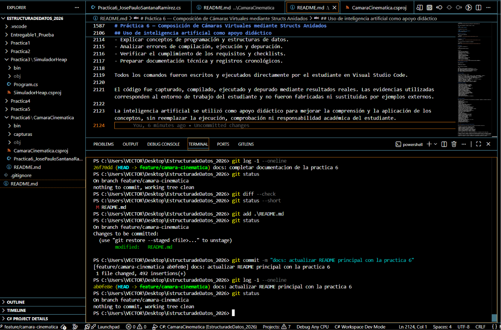
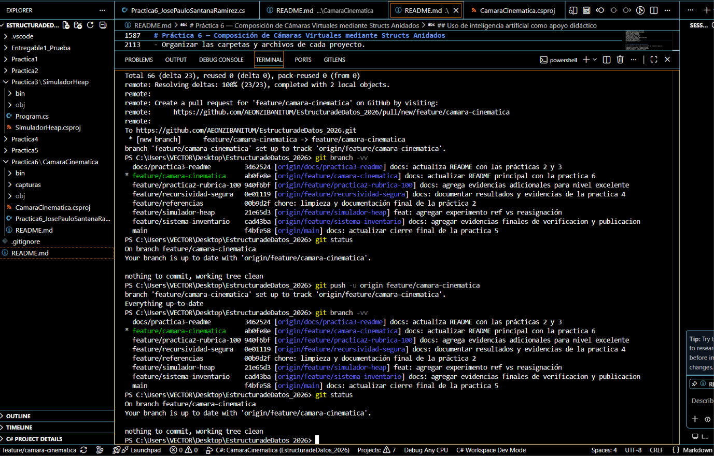
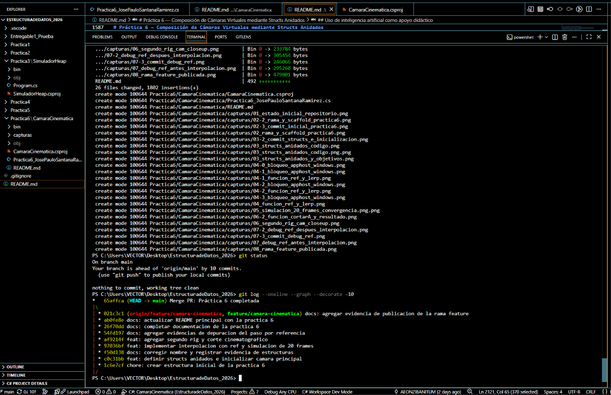
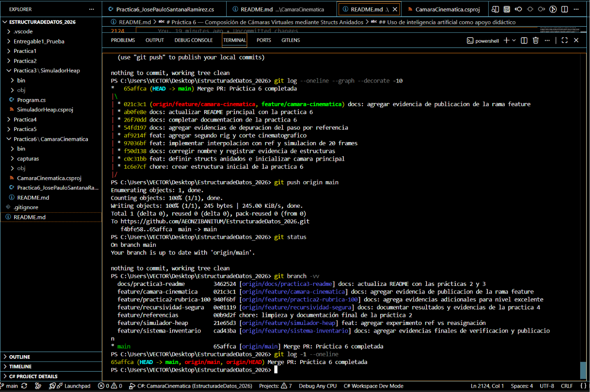

# Práctica 6 — Composición de Cámaras Virtuales mediante Structs Anidados

Simulación de un sistema de cámara cinematográfica virtual desarrollado en **C# con .NET 8**, utilizando estructuras personalizadas anidadas, paso de parámetros mediante `ref`, interpolación lineal progresiva, depuración paso a paso y control de versiones con Git y GitHub.

---

## Información académica

| Dato | Información |
|---|---|
| Alumno | José Paulo Santana Ramírez |
| Matrícula | 14868430 |
| Materia | Estructura de Datos |
| Ciclo | 26-3 |
| Práctica | Práctica 6 — última práctica del bloque |
| Lenguaje | C# |
| Framework | .NET 8 (`net8.0`) |
| Entorno de desarrollo | Visual Studio Code |
| Control de versiones | Git y GitHub |
| Rama de desarrollo | `feature/camara-cinematica` |
| Rama de integración | `main` |
| Fecha de cierre | 28 de julio de 2026 |

---

## Descripción general

La práctica implementa una simulación numérica de una cámara cinematográfica virtual que se desplaza progresivamente desde una posición inicial hacia una posición objetivo.

La cámara también modifica gradualmente el punto tridimensional hacia el cual dirige su enfoque. Como se trata de una aplicación de consola, el movimiento se representa mediante la impresión de las coordenadas de posición y foco durante una secuencia de 20 frames.

El proyecto integra los siguientes conceptos:

- Modelado de datos mediante `struct`.
- Composición de estructuras anidadas.
- Tipos por valor.
- Paso de parámetros mediante `ref`.
- Modificación directa de la variable original.
- Interpolación lineal manual.
- Simulación de frames.
- Formateo de salida en consola.
- Depuración mediante breakpoints.
- Inspección de variables anidadas.
- Uso de Variables, Watch y Call Stack.
- Implementación de un segundo rig cinematográfico.
- Corte instantáneo entre configuraciones de cámara.
- Diagnóstico de una incidencia de AppHost en Windows.
- Control de versiones mediante ramas y commits semánticos.
- Integración mediante `merge --no-ff`.
- Publicación de la rama feature y de `main` en GitHub.

---

## Objetivos

### Objetivo general

Construir un sistema de cámara virtual capaz de modificar progresivamente su posición y su punto de enfoque mediante estructuras anidadas y paso por referencia.

### Objetivos específicos

- Definir las estructuras `Posicion`, `Foco` y `CamaraCinematica`.
- Integrar `Posicion` y `Foco` dentro de `CamaraCinematica`.
- Inicializar todos los campos de la cámara principal.
- Crear una posición y un foco objetivo.
- Implementar el método `ActualizarCamara`.
- Utilizar `ref` para modificar el rig original.
- Aplicar interpolación lineal en los seis componentes tridimensionales.
- Ejecutar una simulación de 20 frames.
- Mostrar la convergencia progresiva de los valores.
- Crear un segundo rig denominado `CAM_CLOSEUP`.
- Implementar una función de corte instantáneo.
- Comprobar mediante depuración el efecto del paso por referencia.
- Documentar el proceso mediante capturas y commits semánticos.
- Publicar la rama de desarrollo.
- Integrar la práctica en `main` mediante `merge --no-ff`.
- Publicar el cierre definitivo en GitHub.

---

## Estructura del proyecto

```text
EstructuradeDatos_2026/
└── Practica6/
    └── CamaraCinematica/
        ├── capturas/
        ├── bin/
        ├── obj/
        ├── CamaraCinematica.csproj
        ├── Practica6_JosePauloSantanaRamirez.cs
        └── README.md
```

Los directorios `bin` y `obj` son generados automáticamente durante la compilación y permanecen excluidos del control de versiones mediante el archivo `.gitignore` de la raíz.

El proyecto conserva un único archivo fuente de C#:

```text
Practica6_JosePauloSantanaRamirez.cs
```

Dentro de ese archivo se encuentran:

```text
Posicion
Foco
CamaraCinematica
Program
├── Main
├── ActualizarCamara
├── ImprimirEstado
└── CortarA
```

---

## Fundamentos aplicados

### Tipos por valor

Los `structs` de C# son tipos por valor. Esto significa que, de forma predeterminada, una asignación o un envío como parámetro produce una copia independiente del valor.

En esta práctica, ese comportamiento es especialmente importante porque `CamaraCinematica` contiene a su vez dos estructuras adicionales.

### Composición

La composición permite agrupar datos relacionados dentro de una estructura principal:

```text
CamaraCinematica
├── nombre
├── fov
├── velocidad
├── pos : Posicion
│   ├── x
│   ├── y
│   └── z
└── foco : Foco
    ├── x
    ├── y
    └── z
```

### Paso por referencia

El modificador `ref` permite que un método trabaje directamente con la variable original, evitando que las modificaciones se realicen sobre una copia temporal del `struct`.

---

## Modelo de datos

### `Posicion`

Representa la ubicación tridimensional de la cámara.

```csharp
public struct Posicion
{
    public float x;
    public float y;
    public float z;
}
```

### `Foco`

Representa el punto tridimensional hacia el cual apunta la cámara.

```csharp
public struct Foco
{
    public float x;
    public float y;
    public float z;
}
```

### `CamaraCinematica`

Agrupa el estado completo de un rig cinematográfico.

```csharp
public struct CamaraCinematica
{
    public string nombre;
    public Posicion pos;
    public Foco foco;
    public float fov;
    public float velocidad;
}
```

Todos los campos fueron declarados como `public` e inicializados antes de ser utilizados.

---

## Cámara principal

El rig principal se denomina:

```text
CAM_PRINCIPAL
```

### Configuración inicial

| Campo | Valor |
|---|---:|
| Nombre | `CAM_PRINCIPAL` |
| Posición X | `10f` |
| Posición Y | `5f` |
| Posición Z | `-8f` |
| Foco X | `0f` |
| Foco Y | `0f` |
| Foco Z | `0f` |
| FOV | `60f` |
| Velocidad | `0.08f` |

La estructura fue inicializada de forma completa:

```csharp
CamaraCinematica camara = new CamaraCinematica
{
    nombre = "CAM_PRINCIPAL",

    pos = new Posicion
    {
        x = 10f,
        y = 5f,
        z = -8f
    },

    foco = new Foco
    {
        x = 0f,
        y = 0f,
        z = 0f
    },

    fov = 60f,
    velocidad = 0.08f
};
```

---

## Objetivos cinematográficos

### Posición objetivo

```text
(0, 2, -5)
```

```csharp
Posicion posicionObjetivo = new Posicion
{
    x = 0f,
    y = 2f,
    z = -5f
};
```

### Foco objetivo

```text
(0, 1, 0)
```

```csharp
Foco focoObjetivo = new Foco
{
    x = 0f,
    y = 1f,
    z = 0f
};
```

---

## Interpolación lineal

La cámara no cambia instantáneamente de posición durante la simulación principal.

En cada frame se desplaza un porcentaje de la distancia que todavía existe entre el valor actual y el objetivo.

La fórmula utilizada es:

```text
actual = actual + (objetivo - actual) × alpha
```

En el programa, `alpha` corresponde a la velocidad del rig:

```csharp
float alpha = cam.velocidad;
```

Para `CAM_PRINCIPAL`:

```text
alpha = 0.08
```

Esto representa un desplazamiento del 8 % de la distancia restante durante cada frame.

---

## Método `ActualizarCamara`

El método central recibe la cámara mediante `ref`:

```csharp
private static void ActualizarCamara(
    ref CamaraCinematica cam,
    Posicion posicionObjetivo,
    Foco focoObjetivo)
```

El modificador `ref` permite que el método trabaje directamente con la variable original creada en `Main`.

Sin `ref`, el método recibiría una copia del `struct` y las modificaciones se perderían al finalizar la llamada.

### Interpolación de posición

La fórmula se aplica individualmente sobre los tres ejes de la posición:

```csharp
cam.pos.x +=
    (posicionObjetivo.x - cam.pos.x) * alpha;

cam.pos.y +=
    (posicionObjetivo.y - cam.pos.y) * alpha;

cam.pos.z +=
    (posicionObjetivo.z - cam.pos.z) * alpha;
```

### Interpolación del foco

La misma operación se aplica sobre los tres componentes del foco:

```csharp
cam.foco.x +=
    (focoObjetivo.x - cam.foco.x) * alpha;

cam.foco.y +=
    (focoObjetivo.y - cam.foco.y) * alpha;

cam.foco.z +=
    (focoObjetivo.z - cam.foco.z) * alpha;
```

En total, la interpolación se realiza sobre seis componentes:

```text
Posición:
- x
- y
- z

Foco:
- x
- y
- z
```

---

## Simulación de 20 frames

El programa ejecuta 20 actualizaciones consecutivas:

```csharp
for (int frame = 1; frame <= 20; frame++)
{
    ActualizarCamara(
        ref camara,
        posicionObjetivo,
        focoObjetivo);

    ImprimirEstado(camara, frame);

    Thread.Sleep(80);
}
```

En cada iteración se realizan las siguientes acciones:

1. Actualizar la cámara mediante `ref`.
2. Aplicar la interpolación en los seis componentes.
3. Imprimir los valores actualizados.
4. Esperar 80 milisegundos.
5. Continuar con el siguiente frame.

---

## Formato de salida

El método `ImprimirEstado` utiliza los formatos:

- `D3` para mostrar el número de frame con tres dígitos.
- `F2` para mostrar las coordenadas con dos decimales.

```csharp
private static void ImprimirEstado(
    CamaraCinematica cam,
    int frame)
{
    Console.WriteLine(
        $"[Frame {frame:D3}] {cam.nombre} | " +
        $"POS({cam.pos.x:F2}, " +
        $"{cam.pos.y:F2}, " +
        $"{cam.pos.z:F2}) | " +
        $"FOCO({cam.foco.x:F2}, " +
        $"{cam.foco.y:F2}, " +
        $"{cam.foco.z:F2})");
}
```

Ejemplo:

```text
[Frame 001] CAM_PRINCIPAL | POS(9.20, 4.76, -7.76) | FOCO(0.00, 0.08, 0.00)
```

---

## Convergencia observada

Los primeros valores de la simulación fueron:

```text
[Frame 001] CAM_PRINCIPAL | POS(9.20, 4.76, -7.76) | FOCO(0.00, 0.08, 0.00)
[Frame 002] CAM_PRINCIPAL | POS(8.46, 4.54, -7.54) | FOCO(0.00, 0.15, 0.00)
[Frame 003] CAM_PRINCIPAL | POS(7.79, 4.34, -7.34) | FOCO(0.00, 0.22, 0.00)
```

El resultado del frame 20 fue:

```text
[Frame 020] CAM_PRINCIPAL | POS(1.89, 2.57, -5.57) | FOCO(0.00, 0.81, 0.00)
```

Los valores avanzan progresivamente hacia:

```text
Posición objetivo: (0.00, 2.00, -5.00)
Foco objetivo:     (0.00, 1.00, 0.00)
```

La interpolación se aproxima continuamente al objetivo sin producir un salto instantáneo.

---

## Segundo rig cinematográfico

Como extensión se implementó un segundo rig:

```text
CAM_CLOSEUP
```

### Configuración

| Campo | Valor |
|---|---:|
| Nombre | `CAM_CLOSEUP` |
| Posición X | `1f` |
| Posición Y | `1.8f` |
| Posición Z | `-1.5f` |
| Foco X | `0f` |
| Foco Y | `1.7f` |
| Foco Z | `0f` |
| FOV | `35f` |
| Velocidad | `0.15f` |

Código:

```csharp
CamaraCinematica camaraCloseUp = new CamaraCinematica
{
    nombre = "CAM_CLOSEUP",

    pos = new Posicion
    {
        x = 1f,
        y = 1.8f,
        z = -1.5f
    },

    foco = new Foco
    {
        x = 0f,
        y = 1.7f,
        z = 0f
    },

    fov = 35f,
    velocidad = 0.15f
};
```

Este rig representa una configuración de plano cercano.

---

## Función de corte instantáneo

También se implementó el método:

```csharp
private static void CortarA(
    ref CamaraCinematica destino,
    CamaraCinematica fuente)
```

La cámara de destino utiliza `ref` porque su estado debe modificarse directamente.

La cámara fuente se recibe por valor porque solamente se consulta.

```csharp
private static void CortarA(
    ref CamaraCinematica destino,
    CamaraCinematica fuente)
{
    destino.pos = fuente.pos;
    destino.foco = fuente.foco;
    destino.fov = fuente.fov;

    Console.WriteLine();

    Console.WriteLine(
        $"Corte instantáneo aplicado: " +
        $"{fuente.nombre} -> {destino.nombre}");
}
```

La función copia:

- Posición.
- Foco.
- Campo de visión.

El nombre del rig principal se conserva para demostrar que se modificó el mismo `struct`.

---

## Resultado del corte

### Antes del corte

```text
[Frame 000] CAM_PRINCIPAL | POS(1.89, 2.57, -5.57) | FOCO(0.00, 0.81, 0.00)
FOV antes del corte: 60.00 grados
```

### Después del corte

```text
[Frame 000] CAM_PRINCIPAL | POS(1.00, 1.80, -1.50) | FOCO(0.00, 1.70, 0.00)
FOV después del corte: 35.00 grados
```

El resultado comprueba que la posición, el foco y el FOV fueron sustituidos correctamente.

---

## Depuración del paso por referencia

Se utilizó el depurador integrado de Visual Studio Code para observar el contenido del rig antes y después de ejecutar la interpolación.

### Estado inicial observado

```text
cam.pos.x  = 10
cam.pos.y  = 5
cam.pos.z  = -8

cam.foco.x = 0
cam.foco.y = 0
cam.foco.z = 0

cam.velocidad = 0.08
```

### Objetivos observados

```text
posicionObjetivo.x = 0
posicionObjetivo.y = 2
posicionObjetivo.z = -5

focoObjetivo.x = 0
focoObjetivo.y = 1
focoObjetivo.z = 0
```

### Estado modificado

Durante la ejecución paso a paso se comprobó que los campos de `cam.pos` y `cam.foco` cambiaron dentro de `ActualizarCamara`.

Al regresar al método principal, los nuevos valores permanecieron almacenados en la cámara original.

Esto demuestra el funcionamiento del modificador `ref` aplicado a un tipo por valor.

### Herramientas utilizadas

- Breakpoints.
- Variables locales.
- Panel Watch.
- Call Stack.
- `F10` para avanzar instrucción por instrucción.
- `F5` para continuar la ejecución.
- `Shift + F5` para detener la sesión.

El mensaje de salida con código `-1` observado al detener una sesión correspondió al cierre manual del proceso de depuración, no a un error del código fuente.

---

## Incidencia de ejecución con AppHost

Durante el desarrollo, Windows bloqueó inicialmente el ejecutable nativo:

```text
CamaraCinematica.exe
```

La compilación era correcta, pero el sistema operativo impedía iniciar el AppHost generado automáticamente.

El programa pudo ejecutarse directamente mediante el ensamblado:

```powershell
dotnet .\Practica6\CamaraCinematica\bin\Debug\net8.0\CamaraCinematica.dll
```

Como solución permanente se añadió al archivo `.csproj`:

```xml
<UseAppHost>false</UseAppHost>
```

Configuración final:

```xml
<Project Sdk="Microsoft.NET.Sdk">

  <PropertyGroup>
    <OutputType>Exe</OutputType>
    <TargetFramework>net8.0</TargetFramework>
    <ImplicitUsings>enable</ImplicitUsings>
    <Nullable>enable</Nullable>
    <UseAppHost>false</UseAppHost>
  </PropertyGroup>

</Project>
```

Esta configuración permite ejecutar el ensamblado administrado mediante el host de .NET sin depender del ejecutable nativo bloqueado.

---

## Compilación

Desde la raíz del repositorio:

```powershell
dotnet build .\Practica6\CamaraCinematica\CamaraCinematica.csproj
```

Resultado esperado:

```text
Compilación realizada correctamente
0 advertencias
0 errores
```

---

## Ejecución

### Ejecución mediante el proyecto

```powershell
dotnet run --project .\Practica6\CamaraCinematica\CamaraCinematica.csproj
```

### Ejecución directa del ensamblado

```powershell
dotnet .\Practica6\CamaraCinematica\bin\Debug\net8.0\CamaraCinematica.dll
```

---

## Pruebas realizadas

| Prueba | Resultado |
|---|---|
| Compilación en `net8.0` | Correcta |
| Definición de tres `structs` | Correcta |
| Inicialización completa | Correcta |
| Posición objetivo | Correcta |
| Foco objetivo | Correcto |
| Método con `ref` | Comprobado |
| Interpolación de posición X | Correcta |
| Interpolación de posición Y | Correcta |
| Interpolación de posición Z | Correcta |
| Interpolación de foco X | Correcta |
| Interpolación de foco Y | Correcta |
| Interpolación de foco Z | Correcta |
| Simulación de 20 frames | Correcta |
| Formato `D3` y `F2` | Correcto |
| Convergencia progresiva | Comprobada |
| Segundo rig `CAM_CLOSEUP` | Correcto |
| Función `CortarA` | Correcta |
| Copia de posición | Comprobada |
| Copia de foco | Comprobada |
| Copia de FOV | Comprobada |
| Depuración antes de la interpolación | Completada |
| Depuración después de la interpolación | Completada |
| Solución de AppHost | Aplicada |
| Publicación de rama feature | Completada |
| Merge `--no-ff` en `main` | Completado |
| Publicación final de `main` | Completada |
| Estado final de Git | Limpio y sincronizado |

---

## Rúbrica cubierta

| Criterio | Implementación | Estado |
|---|---|---|
| Tres `structs` definidos correctamente | `Posicion`, `Foco`, `CamaraCinematica` | Cumplido |
| Campos públicos | Todos los campos son `public` | Cumplido |
| Composición de estructuras | `Posicion` y `Foco` dentro de `CamaraCinematica` | Cumplido |
| Método con `ref` | `ActualizarCamara(ref CamaraCinematica cam, ...)` | Cumplido |
| Interpolación en seis ejes | Tres ejes de posición y tres del foco | Cumplido |
| Simulación mínima de 20 frames | Bucle de frames 1 a 20 | Cumplido |
| Formato de salida | `D3` y `F2` | Cumplido |
| Convergencia progresiva | Valores aproximándose al objetivo | Cumplido |
| Segundo rig | `CAM_CLOSEUP` | Cumplido |
| Función de corte | `CortarA` | Cumplido |
| Depuración del paso por referencia | Breakpoints y variables anidadas | Cumplido |
| Documentación | README y capturas | Cumplido |

---

## Flujo de trabajo con Git

La práctica fue desarrollada en la rama:

```text
feature/camara-cinematica
```

### Commits conservados en el historial

```text
1c6e7cf chore: crear estructura inicial de la practica 6
c0c31bb feat: definir structs anidados e inicializar camara principal
f50d138 docs: corregir nombre y registrar evidencia de estructuras
97036bf feat: implementar interpolacion con ref y simulacion de 20 frames
af9214f feat: agregar segundo rig y corte cinematografico
54fd197 docs: agregar evidencias de depuracion del paso por referencia
26f70dd docs: completar documentacion de la practica 6
ab0fe8e docs: actualizar README principal con la practica 6
021c3c1 docs: agregar evidencia de publicacion de la rama feature
65affca Merge PR: Práctica 6 completada
```

### Publicación de la rama feature

```powershell
git push -u origin feature/camara-cinematica
```

La rama local quedó vinculada con:

```text
origin/feature/camara-cinematica
```

### Integración en `main`

```powershell
git switch main
git pull --ff-only origin main
git merge --no-ff feature/camara-cinematica -m "Merge PR: Práctica 6 completada"
```

El commit de integración fue:

```text
65affca Merge PR: Práctica 6 completada
```

### Publicación final

```powershell
git push origin main
```

Después de la publicación:

```text
main
origin/main
origin/HEAD
```

quedaron alineados con el commit de integración.

---

# Evidencias oficiales

Las capturas se encuentran en:

```text
Practica6/CamaraCinematica/capturas
```

Se conservaron **25 evidencias oficiales**. Los nombres se mantienen exactamente como fueron guardados durante el desarrollo, incluyendo las extensiones dobles existentes en dos archivos.

## Índice completo de capturas

| N.º | Archivo | Evidencia documentada |
|---:|---|---|
| 1 | `01_estado_inicial_repositorio.png` | Estado inicial de `main`, repositorio limpio, remoto y SDK. |
| 2 | `02_rama_y_scaffold_practica6.png` | Creación de la rama y estructura inicial del proyecto. |
| 3 | `02-2_rama_y_scaffold_practica6.png` | Verificación de archivos, `net8.0` y compilación inicial. |
| 4 | `02-3_commit_inicial_practica6.png` | Commit de creación de la estructura inicial. |
| 5 | `03_structs_anidados_codigo.png` | Definición principal de los `structs` anidados. |
| 6 | `03_structs_anidados_codigo.png.png` | Evidencia complementaria del modelado de estructuras. |
| 7 | `03_structs_anidados_y_objetivos.png` | Inicialización de cámara, posición y foco objetivo. |
| 8 | `03-2_commit_structs_e_inicializacion.png` | Commit del modelado y la inicialización. |
| 9 | `04_funcion_ref_y_lerp.png` | Firma con `ref` e interpolación manual. |
| 10 | `04-0_bloqueo_apphost_windows.png` | Incidencia inicial de bloqueo del AppHost. |
| 11 | `04-1_bloqueo_apphost_windows.png` | Diagnóstico y comprobación de ejecución alternativa. |
| 12 | `04-1_funcion_ref_y_lerp.png` | Vista complementaria de `ref` e interpolación. |
| 13 | `04-2_bloqueo_apphost_windows.png` | Continuación de la solución aplicada al bloqueo. |
| 14 | `04-2_funcion_ref_y_lerp.png` | Segunda vista complementaria del método principal. |
| 15 | `04-3_bloqueo_apphost_windows.png` | Evidencia adicional de la incidencia y su resolución. |
| 16 | `05_simulacion_20_frames_convergencia.png.png` | Ejecución completa de los frames 001 a 020. |
| 17 | `06_segundo_rig_cam_closeup.png` | Configuración completa de `CAM_CLOSEUP`. |
| 18 | `06-2_funcion_cortarA_y_resultado.png` | Método `CortarA` y comparación antes/después. |
| 19 | `07_debug_ref_antes_interpolacion.png` | Valores iniciales observados antes de interpolar. |
| 20 | `07-2_debug_ref_despues_interpolacion.png` | Valores modificados dentro de `ActualizarCamara`. |
| 21 | `07-3_commit_debug_ref.png` | Commit de las evidencias de depuración. |
| 22 | `07-4_commit_readme_principal.png` | Commit de actualización del README principal. |
| 23 | `08_rama_feature_publicada.png` | Publicación y sincronización de la rama feature. |
| 24 | `09_merge_practica6_en_main.png` | Integración mediante `merge --no-ff` en `main`. |
| 25 | `10_main_publicada_en_github.png` | Publicación final de `main` y sincronización remota. |

---

# Galería completa de evidencias

## 01 — Estado inicial del repositorio


---

## 02 — Rama y scaffold de la Práctica 6


---

## 02-2 — Verificación de la estructura y compilación


---

## 02-3 — Commit inicial


---

## 03 — Structs anidados


---

## 03 — Evidencia complementaria de structs


---

## 03 — Inicialización y objetivos


---

## 03-2 — Commit de estructuras e inicialización


---

## 04 — Función con `ref` e interpolación


---

## 04-0 — Bloqueo inicial de AppHost


---

## 04-1 — Diagnóstico de AppHost


---

## 04-1 — Vista complementaria de `ref` y `lerp`


---

## 04-2 — Continuación de la solución de AppHost


---

## 04-2 — Segunda vista complementaria de `ref` y `lerp`


---

## 04-3 — Evidencia adicional de AppHost


---

## 05 — Simulación de 20 frames


---

## 06 — Segundo rig `CAM_CLOSEUP`


---

## 06-2 — Función `CortarA` y resultado


---

## 07 — Depuración antes de la interpolación


---

## 07-2 — Depuración después de la interpolación


---

## 07-3 — Commit de depuración


---

## 07-4 — Commit del README principal



---

## 08 — Rama feature publicada



---

## 09 — Integración de la Práctica 6 en `main`



---

## 10 — Publicación final de `main`



---

## Problemas identificados y soluciones

### 1. Modificación de una copia del `struct`

**Riesgo:** enviar `CamaraCinematica` por valor produciría una copia.

**Solución:** utilizar `ref` tanto en la declaración como en la llamada.

```csharp
ActualizarCamara(
    ref camara,
    posicionObjetivo,
    focoObjetivo);
```

### 2. Campos no inicializados

**Riesgo:** leer componentes sin asignar previamente todos sus valores.

**Solución:** utilizar inicializadores completos para las tres estructuras.

### 3. Velocidad inválida

**Riesgo:** una velocidad igual a cero impediría el movimiento.

**Solución:** utilizar valores positivos:

```text
CAM_PRINCIPAL = 0.08
CAM_CLOSEUP   = 0.15
```

### 4. Bloqueo del ejecutable por Windows

**Riesgo:** Windows impidió iniciar el AppHost generado.

**Solución:** ejecutar la DLL con `dotnet` y configurar:

```xml
<UseAppHost>false</UseAppHost>
```

### 5. Verificación insuficiente de `ref`

**Riesgo:** observar únicamente la salida final sin comprobar los valores internos.

**Solución:** utilizar breakpoints y expandir `cam.pos` y `cam.foco` en el panel de variables.

### 6. Capturas sobrescritas con el mismo nombre

Git detecta cambios por el contenido binario del archivo, incluso cuando el nombre y la ruta permanecen iguales.

Por esta razón, una captura sobrescrita debe agregarse nuevamente:

```powershell
git add .\Practica6\CamaraCinematica\capturas\nombre_de_la_captura.png
```

Cuando corresponde integrarla al commit más reciente:

```powershell
git commit --amend --no-edit
```

---

## Aprendizajes obtenidos

Esta práctica permitió comprobar que los `structs` tienen semántica de valor y que el paso normal de parámetros genera una copia independiente.

El uso de `ref` permite modificar directamente una estructura original sin devolverla como resultado.

También se comprobó que una estructura puede contener otras estructuras, permitiendo representar datos relacionados mediante una composición clara.

La interpolación lineal muestra cómo un valor puede aproximarse progresivamente hacia un objetivo mediante operaciones simples aplicadas repetidamente.

El segundo rig y la función `CortarA` demostraron la diferencia entre una transición progresiva y un cambio instantáneo de estado.

La depuración paso a paso permitió observar directamente los valores antes y después de cada modificación, reforzando la relación entre el código, la memoria y el resultado mostrado en consola.

El flujo de Git permitió conservar una evolución trazable mediante commits atómicos, publicación de la rama feature, integración explícita y publicación final de `main`.

---

## Estado final de la Práctica 6

- Proyecto creado dentro del repositorio único `EstructuradeDatos_2026`.
- Proyecto dirigido a .NET 8.
- Archivo fuente único conforme a la entrega.
- Tres estructuras personalizadas implementadas.
- Composición mediante `structs` anidados.
- Campos públicos e inicialización completa.
- Cámara principal configurada.
- Posición y foco objetivo definidos.
- Método `ActualizarCamara` implementado con `ref`.
- Interpolación aplicada en seis componentes.
- Simulación completa de 20 frames.
- Convergencia progresiva comprobada.
- Segundo rig `CAM_CLOSEUP` implementado.
- Función `CortarA` implementada.
- Cambio de posición, foco y FOV comprobado.
- Depuración del paso por referencia completada.
- Incidencia de AppHost diagnosticada y resuelta.
- Compilación realizada sin errores.
- README individual terminado.
- README principal actualizado.
- Veinticinco evidencias oficiales organizadas.
- Rama `feature/camara-cinematica` publicada y sincronizada.
- Integración completada en `main` mediante `merge --no-ff`.
- Commit `Merge PR: Práctica 6 completada` conservado.
- Rama `main` publicada y sincronizada con `origin/main`.
- Repositorio final sin cambios pendientes antes del último cierre documental.

---

## Conclusión

La Práctica 6 fue completada mediante una implementación modular y documentada de una cámara cinematográfica virtual.

El programa utiliza tres estructuras personalizadas, interpolación manual en seis ejes, modificación mediante `ref`, una simulación de 20 frames, un segundo rig de plano cercano y una función de corte instantáneo.

La ejecución demostró la convergencia progresiva de la posición y el foco. La depuración confirmó que los cambios permanecen en la variable original gracias al paso por referencia.

La práctica también fue integrada al flujo de control de versiones del repositorio académico mediante una rama independiente, commits semánticos, publicación remota, merge `--no-ff` y evidencias verificables.

Con esta entrega se completa el bloque de seis prácticas de la materia antes del desarrollo por fases del proyecto final FastCart.

---

## Integridad académica y uso de apoyo didáctico

El código fue construido, ejecutado, depurado y validado dentro del entorno local del estudiante.

Durante el desarrollo se utilizó ChatGPT como herramienta de apoyo didáctico para:

- Comprender la estructura de los comandos.
- Analizar el comportamiento de `struct` y `ref`.
- Organizar el proceso de desarrollo.
- Identificar y resolver errores de compilación y ejecución.
- Estructurar la documentación técnica.
- Verificar el cumplimiento de los requisitos de la práctica.
- Mantener un flujo de Git claro y reproducible.

La herramienta de inteligencia artificial fue utilizada como acompañamiento para el aprendizaje y no como sustitución de la ejecución, comprobación y comprensión del trabajo.

Todas las capturas corresponden al entorno real de Visual Studio Code del estudiante.

---

## Autoría

Desarrollo académico realizado por:

**José Paulo Santana Ramírez**

Matrícula:

**14868430**

Materia:

**Estructura de Datos — Ciclo 26-3**
